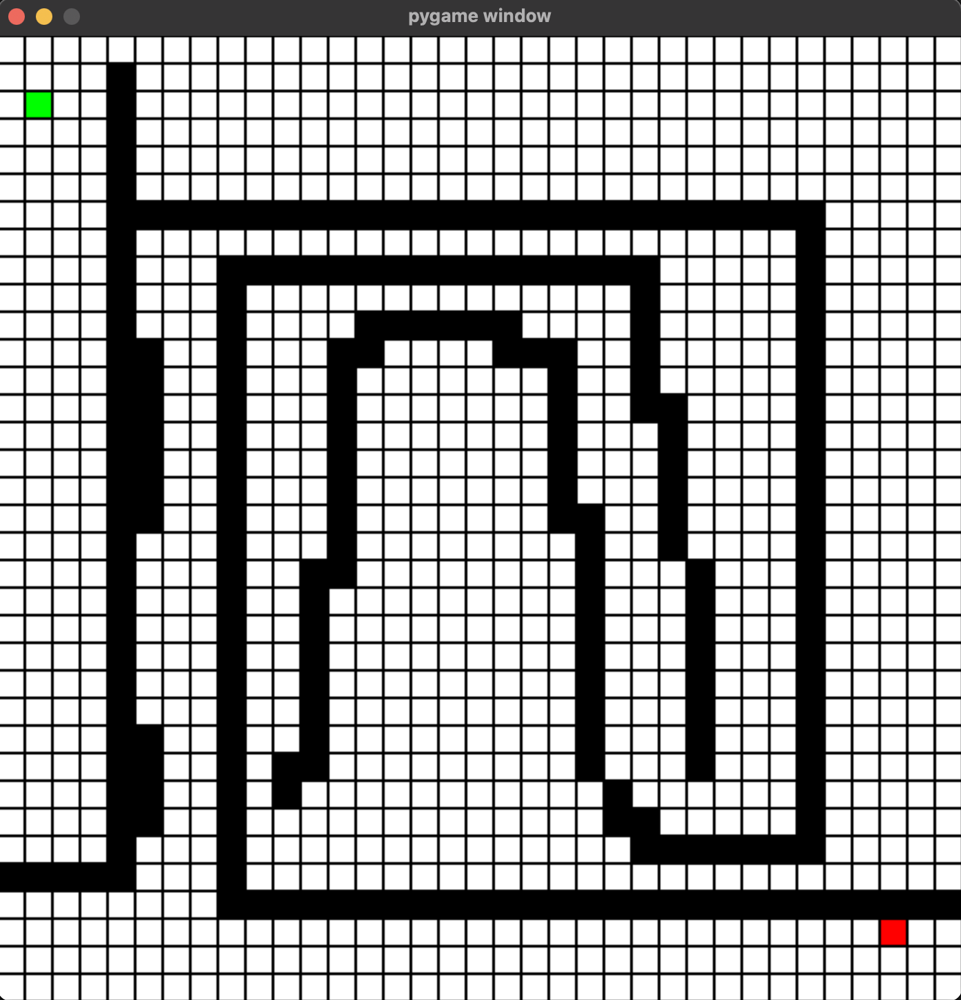

# maze Pathfinders

## About the Project
Python program that allows finding the closest path from the maze provided by the user using the A stars pathfinding algorithm. The project is built like a game, where players can choose the start and end points. Then, the player can decide to draw their maze. The pathfinder algorithm will look for the shortest distance between two points. 

## Built With
* 

## Installations
1. Clone repo
```sh
git clone [URL]
```
2. Install pygame
```sh
pip install pygame
```
## Usage and App ScreenShots





## License
Distributed under the MIT License. See `LICENSE.txt` for more information.
